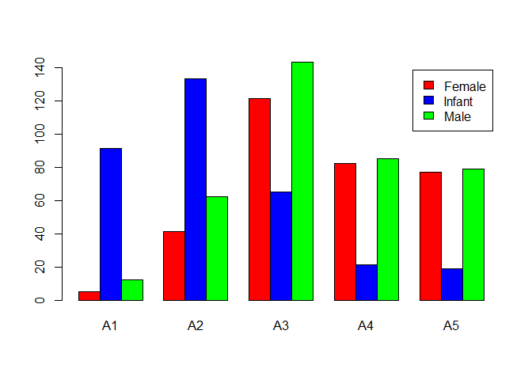
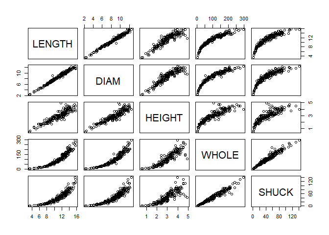
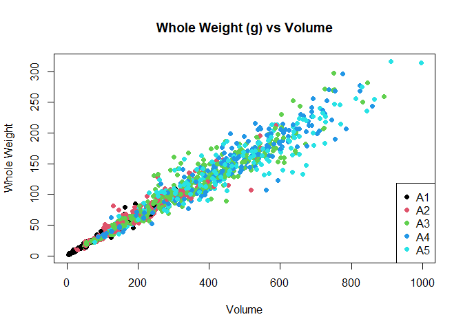
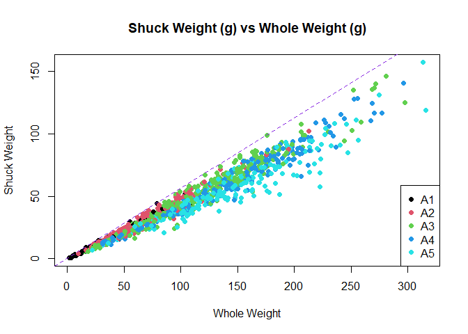
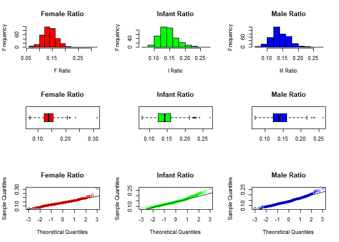
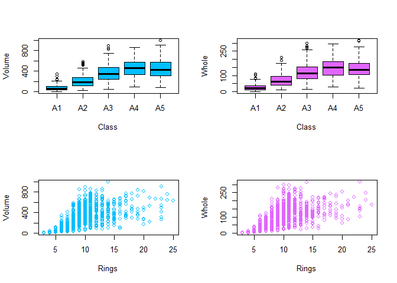
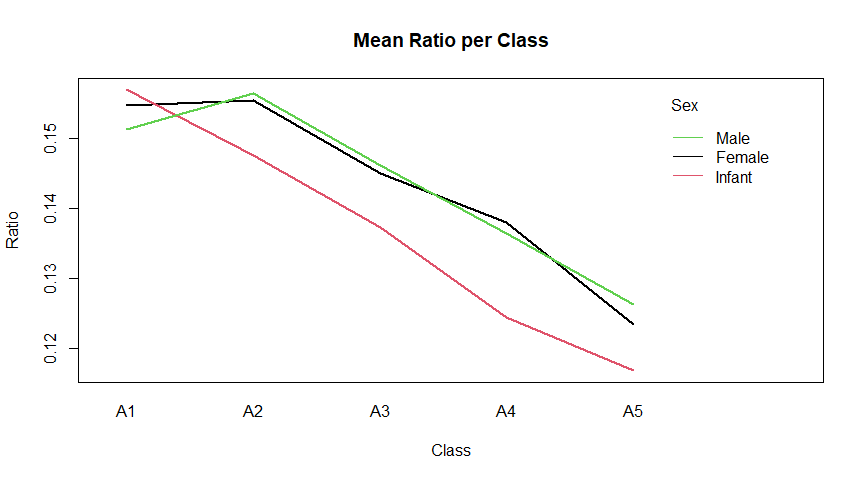
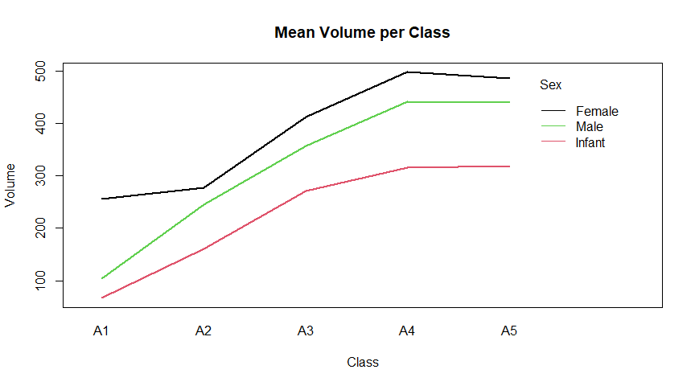
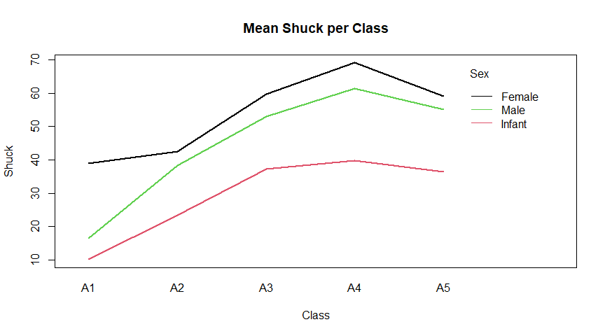
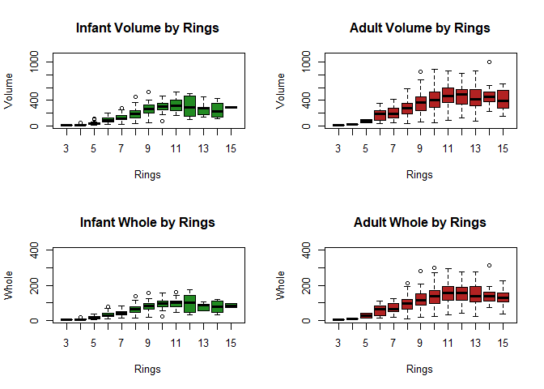

Data Analysis Assignment \#1 (50 points total)
================
Khan, Sameer

-----

Submit both the .Rmd and .html files for grading. You may remove the
instructions and example problem above, but do not remove the YAML
metadata block or the first, “setup” code chunk. Address the steps that
appear below and answer all the questions. Be sure to address each
question with code and comments as needed. You may use either base R
functions or ggplot2 for the visualizations.

-----

The following code chunk will:

1)  load the “ggplot2”, “gridExtra” and “knitr” packages, assuming each
    has been installed on your machine,
2)  read-in the abalones dataset, defining a new data frame, “mydata,”
3)  return the structure of that data frame, and
4)  calculate new variables, VOLUME and RATIO.

Do not include package installation code in this document. Packages
should be installed via the Console or ‘Packages’ tab. You will also
need to download the abalones.csv from the course site to a known
location on your machine. Unless a *file.path()* is specified, R will
look to directory where this .Rmd is stored when knitting.

    ## 'data.frame':    1036 obs. of  8 variables:
    ##  $ SEX   : chr  "I" "I" "I" "I" ...
    ##  $ LENGTH: num  5.57 3.67 10.08 4.09 6.93 ...
    ##  $ DIAM  : num  4.09 2.62 7.35 3.15 4.83 ...
    ##  $ HEIGHT: num  1.26 0.84 2.205 0.945 1.785 ...
    ##  $ WHOLE : num  11.5 3.5 79.38 4.69 21.19 ...
    ##  $ SHUCK : num  4.31 1.19 44 2.25 9.88 ...
    ##  $ RINGS : int  6 4 6 3 6 6 5 6 5 6 ...
    ##  $ CLASS : chr  "A1" "A1" "A1" "A1" ...

-----

### Test Items starts from here - There are 6 sections - Total 50 points

***\#\#\#\#\# Section 1: (6 points) Summarizing the data.***

(1)(a) (1 point) Use *summary()* to obtain and present descriptive
statistics from mydata. Use table() to present a frequency table using
CLASS and RINGS. There should be 115 cells in the table you present.

``` r
mydata$SEX = factor(mydata$SEX, labels=c("Female","Infant","Male"))
mydata$CLASS = factor(mydata$CLASS, labels = c("A1","A2","A3","A4","A5"))
summary(mydata)
```

    ##      SEX          LENGTH           DIAM            HEIGHT     
    ##  Female:326   Min.   : 2.73   Min.   : 1.995   Min.   :0.525  
    ##  Infant:329   1st Qu.: 9.45   1st Qu.: 7.350   1st Qu.:2.415  
    ##  Male  :381   Median :11.45   Median : 8.925   Median :2.940  
    ##               Mean   :11.08   Mean   : 8.622   Mean   :2.947  
    ##               3rd Qu.:13.02   3rd Qu.:10.185   3rd Qu.:3.570  
    ##               Max.   :16.80   Max.   :13.230   Max.   :4.935  
    ##      WHOLE             SHUCK              RINGS        CLASS   
    ##  Min.   :  1.625   Min.   :  0.5625   Min.   : 3.000   A1:108  
    ##  1st Qu.: 56.484   1st Qu.: 23.3006   1st Qu.: 8.000   A2:236  
    ##  Median :101.344   Median : 42.5700   Median : 9.000   A3:329  
    ##  Mean   :105.832   Mean   : 45.4396   Mean   : 9.993   A4:188  
    ##  3rd Qu.:150.319   3rd Qu.: 64.2897   3rd Qu.:11.000   A5:175  
    ##  Max.   :315.750   Max.   :157.0800   Max.   :25.000           
    ##      VOLUME            RATIO        
    ##  Min.   :  3.612   Min.   :0.06734  
    ##  1st Qu.:163.545   1st Qu.:0.12241  
    ##  Median :307.363   Median :0.13914  
    ##  Mean   :326.804   Mean   :0.14205  
    ##  3rd Qu.:463.264   3rd Qu.:0.15911  
    ##  Max.   :995.673   Max.   :0.31176

``` r
table(mydata$CLASS,mydata$RINGS)
```

    ##     
    ##        3   4   5   6   7   8   9  10  11  12  13  14  15  16  17  18  19  20
    ##   A1   9   8  24  67   0   0   0   0   0   0   0   0   0   0   0   0   0   0
    ##   A2   0   0   0   0  91 145   0   0   0   0   0   0   0   0   0   0   0   0
    ##   A3   0   0   0   0   0   0 182 147   0   0   0   0   0   0   0   0   0   0
    ##   A4   0   0   0   0   0   0   0   0 125  63   0   0   0   0   0   0   0   0
    ##   A5   0   0   0   0   0   0   0   0   0   0  48  35  27  15  13   8   8   6
    ##     
    ##       21  22  23  24  25
    ##   A1   0   0   0   0   0
    ##   A2   0   0   0   0   0
    ##   A3   0   0   0   0   0
    ##   A4   0   0   0   0   0
    ##   A5   4   1   7   2   1

**Question (1 point): Briefly discuss the variable types and
distributional implications such as potential skewness and outliers.**

***Answer: The dataset contains 8 numeric variables, and 2 factor
variables (Sex and Class). Sex has 3 factor levels: M, F, and I. Class
has 5 factor levels: A1, A2, A3, A4, A5. Based off of the summary, I see a
few potential outliers; the maximums of WHOLE, SHUCK, RINGS, and VOLUME
are all greater than 1.5(IQR) and have the potential to skew their
histograms to the right **\*

(1)(b) (1 point) Generate a table of counts using SEX and CLASS. Add
margins to this table (Hint: There should be 15 cells in this table plus
the marginal totals. Apply *table()* first, then pass the table object
to *addmargins()* (Kabacoff Section 7.2 pages 144-147)). Lastly, present
a barplot of these data; ignoring the marginal totals.

``` r
table = xtabs(~ SEX+CLASS,data=mydata)
addmargins(table)
```

    ##         CLASS
    ## SEX        A1   A2   A3   A4   A5  Sum
    ##   Female    5   41  121   82   77  326
    ##   Infant   91  133   65   21   19  329
    ##   Male     12   62  143   85   79  381
    ##   Sum     108  236  329  188  175 1036

``` r
barplot(table,legend.text=TRUE,beside=TRUE,col=c("red","blue","green"))
```

<!-- -->

**Essay Question (2 points): Discuss the sex distribution of abalones.
What stands out about the distribution of abalones by CLASS?**

***Answer: It appears that infant abalones make up the majority of class
A1 and A2. A3, the largest class in terms of the number of abalones is
mostly made up of males. Very few infants are present in classes A4 and
A5, which also look to have an approximately even split between males
and females ***

(1)(c) (1 point) Select a simple random sample of 200 observations from
“mydata” and identify this sample as “work.” Use *set.seed(123)* prior
to drawing this sample. Do not change the number 123. Note that
*sample()* “takes a sample of the specified size from the elements of
x.” We cannot sample directly from “mydata.” Instead, we need to
sample from the integers, 1 to 1036, representing the rows of “mydata.”
Then, select those rows from the data frame (Kabacoff Section 4.10.5
page 87).

Using “work”, construct a scatterplot matrix of variables 2-6 with
*plot(work\[, 2:6\])* (these are the continuous variables excluding
VOLUME and RATIO). The sample “work” will not be used in the remainder
of the assignment.

``` r
set.seed(123)
work = mydata[sample(1:nrow(mydata),200,replace=FALSE),]
plot(work[,2:6])
```

<!-- -->

-----

***\#\#\#\#\# Section 2: (5 points) Summarizing the data using
graphics.***

(2)(a) (1 point) Use “mydata” to plot WHOLE versus VOLUME. Color code
data points by CLASS.

``` r
plot(mydata$VOLUME,mydata$WHOLE,main="Whole Weight (g) vs Volume",xlab="Volume",ylab="Whole Weight",col=mydata$CLASS,pch=19)
legend("bottomright",legend=c("A1","A2","A3","A4","A5"), col=1:5,pch=19)
```

<!-- -->

(2)(b) (2 points) Use “mydata” to plot SHUCK versus WHOLE with WHOLE on
the horizontal axis. Color code data points by CLASS. As an aid to
interpretation, determine the maximum value of the ratio of SHUCK to
WHOLE. Add to the chart a straight line with zero intercept using this
maximum value as the slope of the line. If you are using the ‘base R’
*plot()* function, you may use *abline()* to add this line to the plot.
Use *help(abline)* in R to determine the coding for the slope and
intercept arguments in the functions. If you are using ggplot2 for
visualizations, *geom\_abline()* should be used.

``` r
plot(mydata$WHOLE,mydata$SHUCK,main="Shuck Weight (g) vs Whole Weight (g)",xlab="Whole Weight",ylab="Shuck Weight",col=mydata$CLASS,pch=19)
legend("bottomright",legend=levels(mydata$CLASS), col=1:5,pch=19)
abline(0,max(mydata$SHUCK/mydata$WHOLE),col="blueviolet",lty="dashed")
```

<!-- -->

**Essay Question (2 points): How does the variability in this plot
differ from the plot in (a)? Compare the two displays. Keep in mind that
SHUCK is a part of WHOLE. Consider the location of the different age
classes.**

***Answer: The variability for this plot is much smaller than the plot
in part a. Both plots show an increase in the y-variable as the
x-variable increases, which makes sense since the more volume a abalones
has, the more it should weigh. Similarly, since shuck is a part of the
whole weight, we should see a positive correlation for shuck vs whole.
For the ratio of shuck to whole, it appears that older trees (Class
A4, A5) generally have a lower ratio than younger ones (Class A2, A3)***

-----

***\#\#\# Section 3: (8 points) Getting insights about the data using
graphs.***

(3)(a) (2 points) Use “mydata” to create a multi-figured plot with
histograms, boxplots and Q-Q plots of RATIO differentiated by sex. This
can be done using *par(mfrow = c(3,3))* and base R or *grid.arrange()*
and ggplot2. The first row would show the histograms, the second row the
boxplots and the third row the Q-Q plots. Be sure these displays are
legible.

``` r
par(mfrow=c(3,3))
hist(mydata$RATIO[mydata$SEX=="Female"],main="Female Ratio",col="red",xlab="F Ratio")
hist(mydata$RATIO[mydata$SEX=="Infant"],main="Infant Ratio",col="green",xlab="I Ratio")
hist(mydata$RATIO[mydata$SEX=="Male"],main="Male Ratio",col="blue",xlab="M Ratio")
boxplot(mydata$RATIO[mydata$SEX=="Female"],main="Female Ratio",col="red",horizontal = TRUE)
boxplot(mydata$RATIO[mydata$SEX=="Infant"],main="Infant Ratio",col="green",horizontal = TRUE)
boxplot(mydata$RATIO[mydata$SEX=="Male"],main="Male Ratio",col="blue",horizontal = TRUE)
qqnorm(mydata$RATIO[mydata$SEX=="Female"],main="Female Ratio",col="red")
qqline(mydata$RATIO[mydata$SEX=="Female"],main="Female Ratio",col="black")
qqnorm(mydata$RATIO[mydata$SEX=="Infant"],main="Infant Ratio",col="green")
qqline(mydata$RATIO[mydata$SEX=="Infant"],main="Infant Ratio",col="black")
qqnorm(mydata$RATIO[mydata$SEX=="Male"],main="Male Ratio",col="blue")
qqline(mydata$RATIO[mydata$SEX=="Male"],main="Male Ratio",col="black")
```

<!-- -->

``` r
par(mfrow=c(1,1))
```

**Essay Question (2 points): Compare the displays. How do the
distributions compare to normality? Take into account the criteria
discussed in the sync sessions to evaluate non-normality.**

***Answer: We can see from the histograms that all three distributions
are skewed right. The boxplots show a similar result, with most of the
outliers on the right side of the main plot, past the two whiskers.The
QQ plot confirm that the data is not normal, because we see data points
that are above the qqline, further indicating a rightward skew. ***

(3)(b) (2 points) Use the boxplots to identify RATIO outliers (mild and
extreme both) for each sex. Present the abalones with these outlying
RATIO values along with their associated variables in “mydata” (Hint:
display the observations by passing a data frame to the kable()
function).

``` r
female =boxplot.stats(mydata$RATIO[mydata$SEX=="Female"],coef=1.5,do.conf = TRUE,do.out=TRUE)
f_out = female$out
f =mydata[mydata$RATIO %in% f_out,]
infant =boxplot.stats(mydata$RATIO[mydata$SEX=="Infant"],coef=1.5,do.conf = TRUE,do.out=TRUE)
i_out = infant$out
i = mydata[mydata$RATIO %in% i_out,]
male =boxplot.stats(mydata$RATIO[mydata$SEX=="Male"],coef=1.5,do.conf = TRUE,do.out=TRUE)
m_out = male$out
m =mydata[mydata$RATIO %in% m_out,]
rbind(f,i,m)
```

    ##        SEX LENGTH   DIAM HEIGHT     WHOLE     SHUCK RINGS CLASS     VOLUME
    ## 350 Female  7.980  6.720  2.415  80.93750  40.37500     7    A2 129.505824
    ## 379 Female 15.330 11.970  3.465 252.06250 134.89812    10    A3 635.827846
    ## 420 Female 11.550  7.980  3.465 150.62500  68.55375    10    A3 319.365585
    ## 421 Female 13.125 10.290  2.310 142.00000  66.47062     9    A3 311.979937
    ## 458 Female 11.445  8.085  3.150 139.81250  68.49062     9    A3 291.478399
    ## 586 Female 12.180  9.450  4.935 133.87500  38.25000    14    A5 568.023435
    ## 3   Infant 10.080  7.350  2.205  79.37500  44.00000     6    A1 163.364040
    ## 37  Infant  4.305  3.255  0.945   6.18750   2.93750     3    A1  13.242072
    ## 42  Infant  2.835  2.730  0.840   3.62500   1.56250     4    A1   6.501222
    ## 58  Infant  6.720  4.305  1.680  22.62500  11.00000     5    A1  48.601728
    ## 67  Infant  5.040  3.675  0.945   9.65625   3.93750     5    A1  17.503290
    ## 89  Infant  3.360  2.310  0.525   2.43750   0.93750     4    A1   4.074840
    ## 105 Infant  6.930  4.725  1.575  23.37500  11.81250     7    A2  51.572194
    ## 200 Infant  9.135  6.300  2.520  74.56250  32.37500     8    A2 145.027260
    ## 746   Male 13.440 10.815  1.680 130.25000  63.73125    10    A3 244.194048
    ## 754   Male 10.500  7.770  3.150 132.68750  61.13250     9    A3 256.992750
    ## 803   Male 10.710  8.610  3.255 160.31250  70.41375     9    A3 300.153640
    ## 810   Male 12.285  9.870  3.465 176.12500  99.00000    10    A3 420.141472
    ## 852   Male 11.550  8.820  3.360 167.56250  78.27187    10    A3 342.286560
    ##          RATIO
    ## 350 0.31176204
    ## 379 0.21216140
    ## 420 0.21465603
    ## 421 0.21306058
    ## 458 0.23497668
    ## 586 0.06733877
    ## 3   0.26933712
    ## 37  0.22183084
    ## 42  0.24033943
    ## 58  0.22632940
    ## 67  0.22495771
    ## 89  0.23007038
    ## 105 0.22904785
    ## 200 0.22323389
    ## 746 0.26098609
    ## 754 0.23787636
    ## 803 0.23459236
    ## 810 0.23563492
    ## 852 0.22867353

**Essay Question (2 points): What are your observations regarding the
results in (3)(b)?**

***Answer: From the dataframe, we see that the largest ratios
overwhelmingly come from females. Infants have the most number of
outliers (8) and males have the least (5). Most of the outliers have a
large whole weight, but the biggest outlier is a small female with a
large volume. ***

-----

***\#\#\# Section 4: (8 points) Getting insights about possible
predictors.***

(4)(a) (3 points) With “mydata,” display side-by-side boxplots for
VOLUME and WHOLE, each differentiated by CLASS There should be five
boxes for VOLUME and five for WHOLE. Also, display side-by-side
scatterplots: VOLUME and WHOLE versus RINGS. Present these four figures
in one graphic: the boxplots in one row and the scatterplots in a second
row. Base R or ggplot2 may be used.

``` r
par(mfrow=c(2,2))
boxplot(mydata$VOLUME ~ mydata$CLASS, data=mydata,col="deepskyblue",ylab="Volume",xlab="Class")
boxplot(mydata$WHOLE ~ mydata$CLASS, data=mydata,col="mediumorchid1",ylab="Whole",xlab="Class")
plot(mydata$RINGS,mydata$VOLUME, xlab="Rings",ylab="Volume", col="deepskyblue")
plot(mydata$RINGS,mydata$WHOLE, xlab="Rings",ylab="Whole", col="mediumorchid1")
```

<!-- -->

``` r
par(mfrow=c(1,1))
```

**Essay Question (5 points) How well do you think these variables would
perform as predictors of age? Explain.**

***Answer: Volume and whole weight would not be good predictors of age,
according to these plots. We see no established pattern in the scatter
plot; the data point are too spread out. The box plots show a mild
positive trend for both volume and weight in respect to class, but they
would not be very accurate in predicting age either. ***

-----

***\#\#\# Section 5: (12 points) Getting insights regarding different
groups in the data.***

(5)(a) (2 points) Use *aggregate()* with “mydata” to compute the mean
values of VOLUME, SHUCK and RATIO for each combination of SEX and CLASS.
Then, using *matrix()*, create matrices of the mean values. Using the
“dimnames” argument within *matrix()* or the *rownames()* and
*colnames()* functions on the matrices, label the rows by SEX and
columns by CLASS. Present the three matrices (Kabacoff Section 5.6.2,
p. 110-111). The *kable()* function is useful for this purpose. You do
not need to be concerned with the number of digits presented.

``` r
vol = aggregate(VOLUME~SEX+CLASS, data=mydata,mean)
shuck = aggregate(SHUCK~SEX+CLASS, data=mydata,mean)
ratio = aggregate(RATIO~SEX+CLASS, data=mydata,mean)
vol_matrix = matrix(data=vol[,3],nrow=3,byrow=FALSE)
colnames(vol_matrix) = c("A1","A2","A3","A4","A5")
rownames(vol_matrix) = c("Female Vol","Infant Vol","Male Vol")

shuck_matrix = matrix(data=shuck[,3],nrow=3,byrow=FALSE)
colnames(shuck_matrix) = c("A1","A2","A3","A4","A5")
rownames(shuck_matrix) = c("Female Shuck","Infant Shuck","Male Shuck")

ratio_matrix = matrix(data=ratio[,3],nrow=3,byrow=FALSE)
colnames(ratio_matrix) = c("A1","A2","A3","A4","A5")
rownames(ratio_matrix) = c("Female Ratio","Infant Ratio","Male Ratio")

vol_matrix
```

    ##                   A1       A2       A3       A4       A5
    ## Female Vol 255.29938 276.8573 412.6079 498.0489 486.1525
    ## Infant Vol  66.51618 160.3200 270.7406 316.4129 318.6930
    ## Male Vol   103.72320 245.3857 358.1181 442.6155 440.2074

``` r
shuck_matrix
```

    ##                    A1       A2       A3       A4       A5
    ## Female Shuck 38.90000 42.50305 59.69121 69.05161 59.17076
    ## Infant Shuck 10.11332 23.41024 37.17969 39.85369 36.47047
    ## Male Shuck   16.39583 38.33855 52.96933 61.42726 55.02762

``` r
ratio_matrix
```

    ##                     A1        A2        A3        A4        A5
    ## Female Ratio 0.1546644 0.1554605 0.1450304 0.1379609 0.1233605
    ## Infant Ratio 0.1569554 0.1475600 0.1372256 0.1244413 0.1167649
    ## Male Ratio   0.1512698 0.1564017 0.1462123 0.1364881 0.1262089

(5)(b) (3 points) Present three graphs. Each graph should include three
lines, one for each sex. The first should show mean RATIO versus CLASS;
the second, mean VOLUME versus CLASS; the third, mean SHUCK versus
CLASS. This may be done with the ‘base R’ *interaction.plot()* function
or with ggplot2 using *grid.arrange()*.

``` r
interaction.plot(mydata$CLASS,mydata$SEX,mydata$RATIO,fun=mean,type="l",legend = TRUE,trace.label = "Sex",col=1:3,lty="solid",lwd=2,main= "Mean Ratio per Class",xlab="Class",ylab="Ratio")
```

<!-- -->

``` r
interaction.plot(mydata$CLASS,mydata$SEX,mydata$VOLUME,fun=mean,type="l",legend = TRUE,trace.label = "Sex",col=1:3,lty="solid",lwd=2,main= "Mean Volume per Class",xlab="Class",ylab="Volume")
```

<!-- -->

``` r
interaction.plot(mydata$CLASS,mydata$SEX,mydata$SHUCK,fun=mean,type="l",legend = TRUE,trace.label = "Sex",col=1:3,lty="solid",lwd=2,main= "Mean Shuck per Class",xlab="Class",ylab="Shuck")
```

<!-- -->

**Essay Question (2 points): What questions do these plots raise?
Consider aging and sex differences.**

***Answer: The charts show that mean ratio decreases with class for all
sexes, mean volume increases with class for all sexes, and mean shuck
increases and up till A4 and then decreases in A5 for all sexes.
Questions could be raised regarding the differences between males and
females; females have a greater mean volume and shuck weight than males,
but they both appear to have similar mean ratios. ***

5(c) (3 points) Present four boxplots using *par(mfrow = c(2, 2)* or
*grid.arrange()*. The first line should show VOLUME by RINGS for the
infants and, separately, for the adult; factor levels “M” and “F,”
combined. The second line should show WHOLE by RINGS for the infants
and, separately, for the adults. Since the data are sparse beyond 15
rings, limit the displays to less than 16 rings. One way to accomplish
this is to generate a new data set using subset() to select RINGS \< 16.
Use ylim = c(0, 1100) for VOLUME and ylim = c(0, 400) for WHOLE. If you
wish to reorder the displays for presentation purposes or use ggplot2 go
ahead.

``` r
par(mfrow=c(2,2))
infant_data = mydata[mydata$SEX=="Infant",]
infant_data = infant_data[infant_data$RINGS < 16,]
boxplot(infant_data$VOLUME~infant_data$RINGS, data = infant_data,xlab="Rings",ylab="Volume",main="Infant Volume by Rings",col="forestgreen",ylim = c(0,1100))

adult_data = mydata[mydata$SEX=="Female"|mydata$SEX=="Male",]
adult_data = adult_data[adult_data$RINGS < 16,]
boxplot(adult_data$VOLUME~adult_data$RINGS, data = adult_data,xlab="Rings",ylab="Volume",main="Adult Volume by Rings",col="firebrick",ylim = c(0,1100))

boxplot(infant_data$WHOLE~infant_data$RINGS, data = infant_data,xlab="Rings",ylab="Whole",main="Infant Whole by Rings",col="forestgreen",ylim = c(0,400))

boxplot(adult_data$WHOLE~adult_data$RINGS, data = adult_data,xlab="Rings",ylab="Whole",main="Adult Whole by Rings",col="firebrick",ylim = c(0,400))
```

<!-- -->

**Essay Question (2 points): What do these displays suggest about
abalone growth? Also, compare the infant and adult displays. What
differences stand out?**

***Answer: Based on the displays, it looks like adult and infant
abalones grow in both volume and whole weight as they get older (ring
count). We see a peak volume and whole for infants at about 9-11 rings,
adults have a similar peak at about 11-12 rings. Adults definitely have
a larger range for both volume and whole when compared to infants. ***

-----

***\#\#\# Section 6: (11 points) Conclusions from the Exploratory Data
Analysis (EDA).***

**Conclusions**

**Essay Question 1) (5 points) Based solely on these data, what are
plausible statistical reasons that explain the failure of the original
study? Consider to what extent physical measurements may be used for age
prediction.**

***Answer: There are a few statistical reasons that could explain the
failure of the original study. There were quite a few outliers given the
sample size, which skewed the data to the right and didn’t allow for any
normal approximation for the data. Physical measurements were shown to
be a decent predictor of age, but they are not complete enough to show a
full picture. Some infant trees were shown to have the same amount of
rings as adult male or femlae ones. In addition, many of the variables
seemed redundant or needed clarification. Shuck was a derivation of
weight, and I’m not sure how much new information it gave us. The
classification criteria of abalones was also a mystery; how would one
differentiate between an A2 and A3? Physical measurements also have much
room for error. Depending on the location that the sample of abalones
come from, external factors like weather or wildlife could play a part
in affecting the physical measurements. ***

**Essay Question 2) (3 points) Do not refer to the abalone data or
study. If you were presented with an overall histogram and summary
statistics from a sample of some population or phenomenon and no other
information, what questions might you ask before accepting them as
representative of the sampled population or phenomenon?**

***Answer: I would ask for the sample size of the study and a breakdown
of all the variables used. If the histogram was not normal, I would
determine skewness and ask for more information regarding the number of
outliers. If the histogram was normal I would ask about the sample mean
and standard deviation if not already given. It would be nice to know if
any of the variables are correlated with each other, or have a breakdown
of the numeric variables by each categorical one. ***

**Essay Question 3) (3 points) Do not refer to the abalone data or
study. What do you see as difficulties analyzing data derived from
observational studies? Can causality be determined? What might be
learned from such studies?**

***Answer: Observational studies could lead to a variety of potential
problems due to the very nature of the study. Observational studies only
show you a certain part of the whole picture; there could be missing
variables, external factors, or a larger sample that could lead to false
conclusions or biases. This would have a direct effect in determining
causality and making it extremely difficult to verify. Observational
studies can offer a good starting point when testing a hypothesis or
performing an experiment and can be used as reference if needed. ***
