Data Analysis Assignment \#2 (75 points total)
================
Khan, Sameer

\#\#Data Analysis \#2

``` r
# Perform the following steps to start the assignment.
 
# 1) Load/attach the following packages via library():  flux, ggplot2, gridExtra, moments, rockchalk, car.
# NOTE:  packages must be installed via install.packages() before they can be loaded.

library(dplyr)
library(flux)
library(ggplot2)
library(gridExtra)
library(knitr)
library(rockchalk)
library(tidyverse)

# 2) Use the "mydata.csv" file from Assignment #1 or use the file posted on the course site.  Reading
# the files into R will require sep = "" or sep = " " to format data properly.  Use str() to check file
# structure.

mydata <- read.csv("mydata.csv", sep = ",", stringsAsFactors = TRUE)
# mydata <- read.csv(file.path("c:...", "mydata.csv"), sep = ",")
# mydata <- read.csv(file.path("c:/Rabalone/", "mydata.csv"), sep = ",")

str(mydata)
```

    ## 'data.frame':    1036 obs. of  10 variables:
    ##  $ SEX   : Factor w/ 3 levels "F","I","M": 2 2 2 2 2 2 2 2 2 2 ...
    ##  $ LENGTH: num  5.57 3.67 10.08 4.09 6.93 ...
    ##  $ DIAM  : num  4.09 2.62 7.35 3.15 4.83 ...
    ##  $ HEIGHT: num  1.26 0.84 2.205 0.945 1.785 ...
    ##  $ WHOLE : num  11.5 3.5 79.38 4.69 21.19 ...
    ##  $ SHUCK : num  4.31 1.19 44 2.25 9.88 ...
    ##  $ RINGS : int  6 4 6 3 6 6 5 6 5 6 ...
    ##  $ CLASS : Factor w/ 5 levels "A1","A2","A3",..: 1 1 1 1 1 1 1 1 1 1 ...
    ##  $ VOLUME: num  28.7 8.1 163.4 12.2 59.7 ...
    ##  $ RATIO : num  0.15 0.147 0.269 0.185 0.165 ...

### Test Items starts from here - There are 10 sections - total of 75 points

***\#\#\#\# Section 1: (5 points) \#\#\#\#***

(1)(a) Form a histogram and QQ plot using RATIO. Calculate skewness and
kurtosis using ‘rockchalk.’ Be aware that with ‘rockchalk’, the kurtosis
value has 3.0 subtracted from it which differs from the ‘moments’
package.

``` r
skewness(mydata$RATIO)
```

    ## [1] 0.7147056

``` r
kurtosis(mydata$RATIO,excess = FALSE)
```

    ## [1] 4.667298

``` r
par(mfrow=c(1,2))
hist(mydata$RATIO,col="lawngreen",xlab="Ratio",ylab="Count",main="Ratio Histogram")
qqnorm(mydata$RATIO,col="hotpink",main="Ratio QQ Plot")
qqline(mydata$RATIO)
```

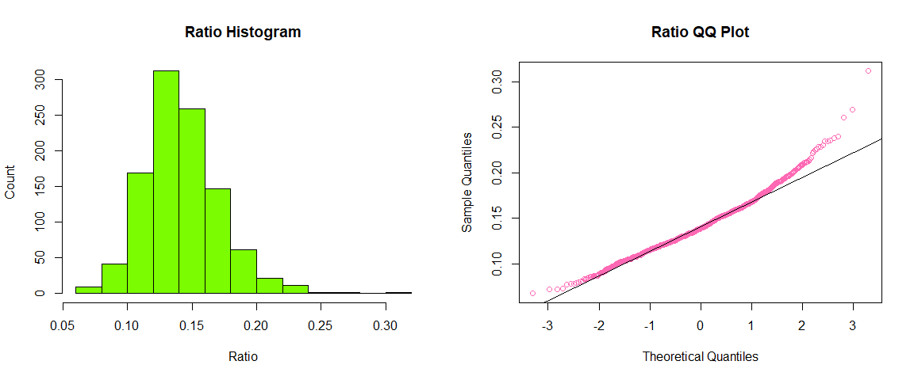<!-- -->

``` r
par(mfrow=c(1,1))
```

(1)(b) Tranform RATIO using *log10()* to create L\_RATIO (Kabacoff
Section 8.5.2, p. 199-200). Form a histogram and QQ plot using L\_RATIO.
Calculate the skewness and kurtosis. Create a boxplot of L\_RATIO
differentiated by CLASS.

``` r
L_RATIO = log10(mydata$RATIO)

par(mfrow=c(1,2))
hist(L_RATIO,col="lawngreen",xlab="L_Ratio",ylab="Count",main="L_Ratio Histogram")
qqnorm(L_RATIO,col="hotpink",main="L_Ratio QQ Plot")
qqline(L_RATIO)
```

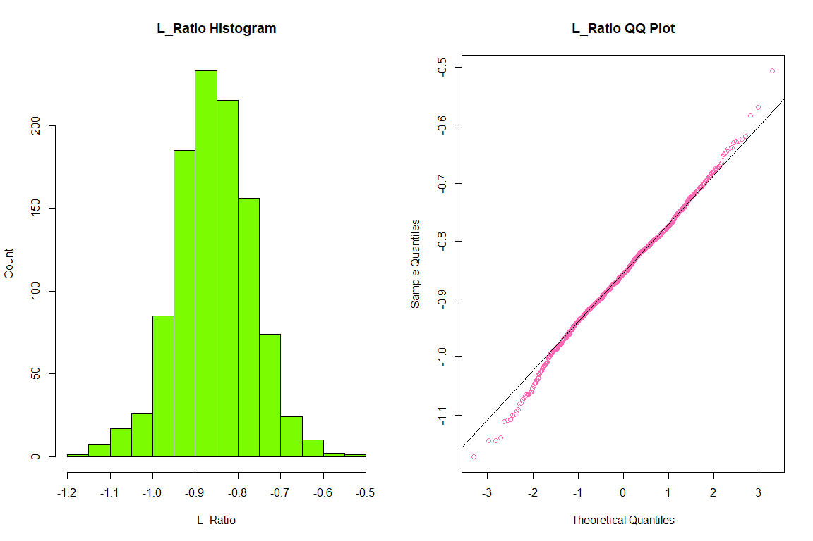<!-- -->

``` r
par(mfrow=c(1,1))
boxplot(L_RATIO~mydata$CLASS, main="Boxplot of L_Ratio",xlab="Class",ylab="L_Ratio")
```

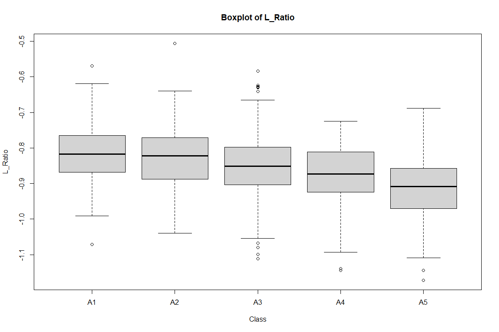<!-- -->

``` r
skewness(L_RATIO)
```

    ## [1] -0.09391548

``` r
kurtosis(L_RATIO, excess = FALSE)
```

    ## [1] 3.535431

(1)(c) Test the homogeneity of variance across classes using
*bartlett.test()* (Kabacoff Section 9.2.2, p. 222).

``` r
bartlett.test(L_RATIO~mydata$CLASS)
```

    ## 
    ##  Bartlett test of homogeneity of variances
    ## 
    ## data:  L_RATIO by mydata$CLASS
    ## Bartlett's K-squared = 3.1891, df = 4, p-value = 0.5267

**Essay Question: Based on steps 1.a, 1.b and 1.c, which variable RATIO
or L\_RATIO exhibits better conformance to a normal distribution with
homogeneous variances across age classes? Why?**

***Answer: L\_RATIO exhibits better conformance to a normal distribution
with homogeneous variances across age classes. We can see that the
histogram is more normal looking in shape, and there is less skewness in
the QQ plot; it adheres more tightly to the QQ line. We also see that
the null hypothesis of homogeneity in the Bartlett test fails to be
rejected.***

***\#\#\#\# Section 2 (10 points) \#\#\#\#***

(2)(a) Perform an analysis of variance with *aov()* on L\_RATIO using
CLASS and SEX as the independent variables (Kabacoff chapter 9,
p. 212-229). Assume equal variances. Perform two analyses. First, fit a
model with the interaction term CLASS:SEX. Then, fit a model without
CLASS:SEX. Use *summary()* to obtain the analysis of variance tables
(Kabacoff chapter 9, p. 227).

``` r
summary(aov(L_RATIO~CLASS+SEX+CLASS:SEX,data=mydata))
```

    ##               Df Sum Sq Mean Sq F value  Pr(>F)    
    ## CLASS          4  1.055 0.26384  38.370 < 2e-16 ***
    ## SEX            2  0.091 0.04569   6.644 0.00136 ** 
    ## CLASS:SEX      8  0.027 0.00334   0.485 0.86709    
    ## Residuals   1021  7.021 0.00688                    
    ## ---
    ## Signif. codes:  0 '***' 0.001 '**' 0.01 '*' 0.05 '.' 0.1 ' ' 1

``` r
summary(aov(L_RATIO~CLASS+SEX,data=mydata))
```

    ##               Df Sum Sq Mean Sq F value  Pr(>F)    
    ## CLASS          4  1.055 0.26384  38.524 < 2e-16 ***
    ## SEX            2  0.091 0.04569   6.671 0.00132 ** 
    ## Residuals   1029  7.047 0.00685                    
    ## ---
    ## Signif. codes:  0 '***' 0.001 '**' 0.01 '*' 0.05 '.' 0.1 ' ' 1

**Essay Question: Compare the two analyses. What does the
non-significant interaction term suggest about the relationship between
L\_RATIO and the factors CLASS and SEX?**

***Answer: We see from the first summary that the p-value for the
interaction term is not statistically significant. The effect of Class
and Sex themselves are significant. ***

(2)(b) For the model without CLASS:SEX (i.e. an interaction term),
obtain multiple comparisons with the *TukeyHSD()* function. Interpret
the results at the 95% confidence level (*TukeyHSD()* will adjust for
unequal sample sizes).

``` r
x = aov(L_RATIO~CLASS+SEX,data=mydata)
TukeyHSD(x)
```

    ##   Tukey multiple comparisons of means
    ##     95% family-wise confidence level
    ## 
    ## Fit: aov(formula = L_RATIO ~ CLASS + SEX, data = mydata)
    ## 
    ## $CLASS
    ##              diff         lwr          upr     p adj
    ## A2-A1 -0.01248831 -0.03876038  0.013783756 0.6919456
    ## A3-A1 -0.03426008 -0.05933928 -0.009180867 0.0018630
    ## A4-A1 -0.05863763 -0.08594237 -0.031332896 0.0000001
    ## A5-A1 -0.09997200 -0.12764430 -0.072299703 0.0000000
    ## A3-A2 -0.02177176 -0.04106269 -0.002480831 0.0178413
    ## A4-A2 -0.04614932 -0.06825638 -0.024042262 0.0000002
    ## A5-A2 -0.08748369 -0.11004316 -0.064924223 0.0000000
    ## A4-A3 -0.02437756 -0.04505283 -0.003702280 0.0114638
    ## A5-A3 -0.06571193 -0.08687025 -0.044553605 0.0000000
    ## A5-A4 -0.04133437 -0.06508845 -0.017580286 0.0000223
    ## 
    ## $SEX
    ##             diff          lwr           upr     p adj
    ## I-F -0.015890329 -0.031069561 -0.0007110968 0.0376673
    ## M-F  0.002069057 -0.012585555  0.0167236690 0.9412689
    ## M-I  0.017959386  0.003340824  0.0325779478 0.0111881

**Additional Essay Question: first, interpret the trend in coefficients
across age classes. What is this indicating about L\_RATIO? Second, do
these results suggest male and female abalones can be combined into a
single category labeled as ‘adults?’ If not, why not?**

***Answer: We see that the difference coefficients are all significant
except for A2-A1. This means that the L\_Ratio means across each group
are different. The p-value is significant for infants and females and
infants to males, but the p-value is not significant for males to
females. This means that we can label both males and females into a
singular adult category ***

***\#\#\#\# Section 3: (10 points) \#\#\#\#***

(3)(a1) Here, we will combine “M” and “F” into a new level, “ADULT”. The
code for doing this is given to you. For (3)(a1), all you need to do is
execute the code as given.

``` r
# Here, we show how to define the new variable TYPE using only base R functions:
 mydata$TYPE <- factor(ifelse(mydata$SEX == "I", "I", "ADULT"))
 table(mydata$TYPE)
```

    ## 
    ## ADULT     I 
    ##   707   329

(3)(a2) Present side-by-side histograms of VOLUME. One should display
infant volumes and, the other, adult volumes.

``` r
par(mfrow=c(1,2))
hist(mydata$VOLUME[mydata$TYPE=="I"],col="lightblue1",xlab="Volume",ylab="Count",main="Infant Volume")
hist(mydata$VOLUME[mydata$TYPE=="ADULT"],col="orangered2",xlab="Volume",ylab="Count",main="Adult Volume")
```

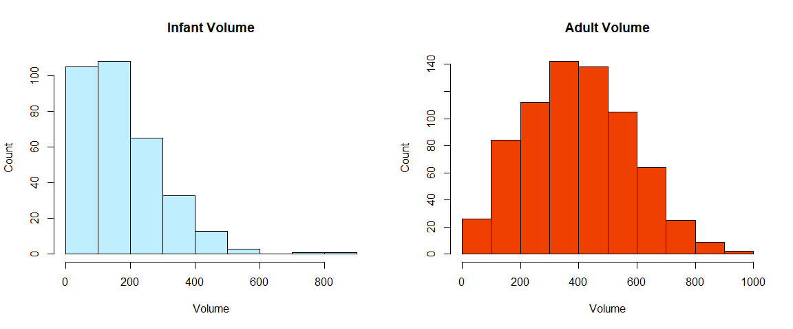<!-- -->

**Essay Question: Compare the histograms. How do the distributions
differ? Are there going to be any difficulties separating infants from
adults based on VOLUME?**

***Answer: The distribution of infants is skewed right, while the
distribution of adults looks approx. normal. There appears to be some
overlap between infant and adult volumes, but it should not be too
difficult to separate based on volumes. The majority of infants have a
volume of 200 or less, in contrast, the majority of adults have a volume
of over 200. ***

(3)(b) Create a scatterplot of SHUCK versus VOLUME and a scatterplot of
their base ten logarithms, labeling the variables as L\_SHUCK and
L\_VOLUME. Please be aware the variables, L\_SHUCK and L\_VOLUME,
present the data as orders of magnitude (i.e. VOLUME = 100 = 10^2
becomes L\_VOLUME = 2). Use color to differentiate CLASS in the plots.
Repeat using color to differentiate by TYPE.

``` r
L_SHUCK = log10(mydata$SHUCK)
L_VOLUME = log10(mydata$VOLUME)

par(mfrow=c(1,2))
plot(mydata$VOLUME,mydata$SHUCK,xlab="Volume",ylab="Shuck",col=mydata$CLASS,pch=1)
legend("bottomright",legend = levels(mydata$CLASS),col=1:length(mydata$CLASS), pch=1, bty="n", title="CLASS")

plot(L_VOLUME,L_SHUCK,xlab="L_Volume",ylab="L_Shuck",col=mydata$CLASS,pch=1)
legend("bottomright",legend = levels(mydata$CLASS),col=1:length(mydata$CLASS), pch=1, bty="n", title="CLASS")
```

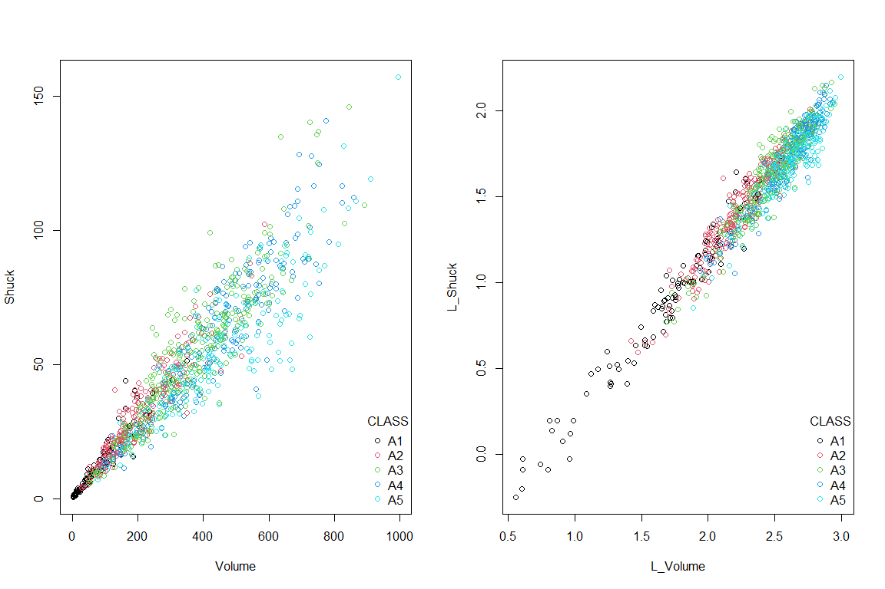<!-- -->

``` r
par(mfrow=c(1,2))
plot(mydata$VOLUME,mydata$SHUCK,xlab="Volume",ylab="Shuck",col=c("green","blue")[mydata$TYPE],pch=1)
legend("bottomright",legend = levels(mydata$TYPE),col=c("green","blue"), pch=1, bty="n", title="CLASS")

plot(L_VOLUME,L_SHUCK,xlab="L_Volume",ylab="L_Shuck",col=c("green","blue")[mydata$TYPE],pch=1)
legend("bottomright",legend = levels(mydata$TYPE),col=c("green","blue"), pch=1, bty="n", title="CLASS")
```

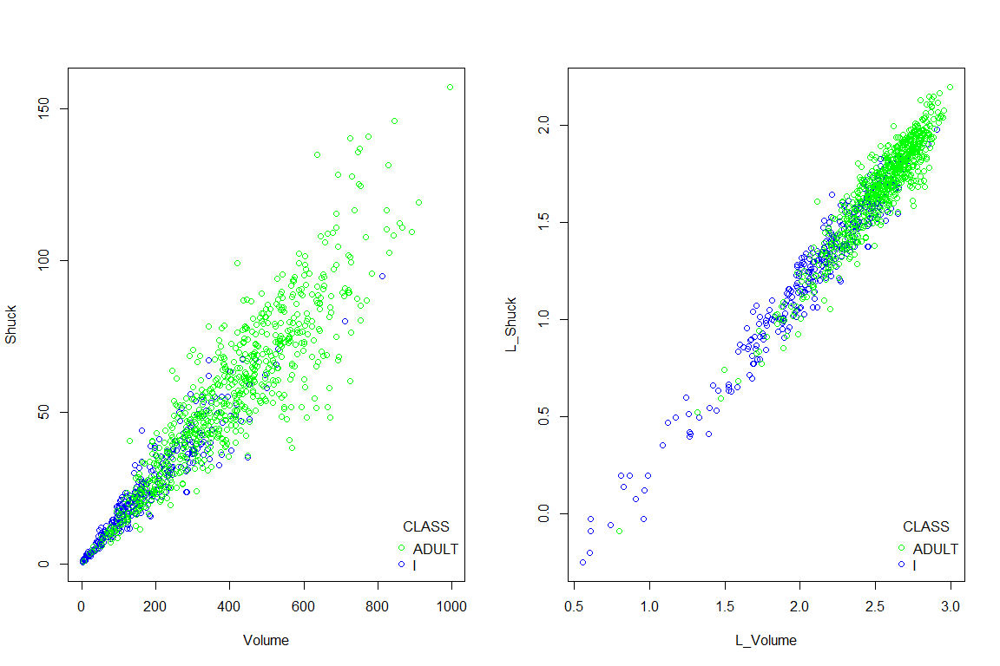<!-- -->

**Additional Essay Question: Compare the two scatterplots. What
effect(s) does log-transformation appear to have on the variability
present in the plot? What are the implications for linear regression
analysis? Where do the various CLASS levels appear in the plots? Where
do the levels of TYPE appear in the plots?**

***Answer: Log-transformation appears to greatly decrease the
variability in the data points and gives a much tighter plot. We also
see much less overlap for each class in terms of volume; there is a
progression from A1-A5 that we can see in the log graphs. With regards
to linear regression analysis, this would mean a much more accurate
trend line with low error residuals. For the type plots, we see that
infants have a wide range of shuck and volume; adults are concentrated
at mostly high shuck and volume levels. ***

***\#\#\#\# Section 4: (5 points) \#\#\#\#***

(4)(a1) Since abalone growth slows after class A3, infants in classes A4
and A5 are considered mature and candidates for harvest. You are given
code in (4)(a1) to reclassify the infants in classes A4 and A5 as
ADULTS.

``` r
mydata$TYPE[mydata$CLASS == "A4" | mydata$CLASS == "A5"] <- "ADULT"
table(mydata$TYPE)
```

    ## 
    ## ADULT     I 
    ##   747   289

(4)(a2) Regress L\_SHUCK as the dependent variable on L\_VOLUME, CLASS
and TYPE (Kabacoff Section 8.2.4, p. 178-186, the Data Analysis Video
\#2 and Black Section 14.2). Use the multiple regression model: L\_SHUCK
\~ L\_VOLUME + CLASS + TYPE. Apply *summary()* to the model object to
produce results.

``` r
model = lm(L_SHUCK~L_VOLUME+CLASS+TYPE,data=mydata)
summary(model)
```

    ## 
    ## Call:
    ## lm(formula = L_SHUCK ~ L_VOLUME + CLASS + TYPE, data = mydata)
    ## 
    ## Residuals:
    ##       Min        1Q    Median        3Q       Max 
    ## -0.270634 -0.054287  0.000159  0.055986  0.309718 
    ## 
    ## Coefficients:
    ##              Estimate Std. Error t value Pr(>|t|)    
    ## (Intercept) -0.796418   0.021718 -36.672  < 2e-16 ***
    ## L_VOLUME     0.999303   0.010262  97.377  < 2e-16 ***
    ## CLASSA2     -0.018005   0.011005  -1.636 0.102124    
    ## CLASSA3     -0.047310   0.012474  -3.793 0.000158 ***
    ## CLASSA4     -0.075782   0.014056  -5.391 8.67e-08 ***
    ## CLASSA5     -0.117119   0.014131  -8.288 3.56e-16 ***
    ## TYPEI       -0.021093   0.007688  -2.744 0.006180 ** 
    ## ---
    ## Signif. codes:  0 '***' 0.001 '**' 0.01 '*' 0.05 '.' 0.1 ' ' 1
    ## 
    ## Residual standard error: 0.08297 on 1029 degrees of freedom
    ## Multiple R-squared:  0.9504, Adjusted R-squared:  0.9501 
    ## F-statistic:  3287 on 6 and 1029 DF,  p-value: < 2.2e-16

**Essay Question: Interpret the trend in CLASS level coefficient
estimates? (Hint: this question is not asking if the estimates are
statistically significant. It is asking for an interpretation of the
pattern in these coefficients, and how this pattern relates to the
earlier displays).**

***Answer: As class increases, each coefficient becomes a larger
negative number.This means that as class increases, L\_SHUCK will become
smaller. We are unable to see this in the scatter plots in question 3,
but we can see this in the boxplots in question 1. ***

**Additional Essay Question: Is TYPE an important predictor in this
regression? (Hint: This question is not asking if TYPE is statistically
significant, but rather how it compares to the other independent
variables in terms of its contribution to predictions of L\_SHUCK for
harvesting decisions.) Explain your conclusion.**

***Answer: Type is not an important predictor of L\_SHUCK. It has the
second smallest coefficient, being only larger than class A2. It’s
p-value is significant, but less so than the other independent variables
(besides A2) ***

-----

The next two analysis steps involve an analysis of the residuals
resulting from the regression model in (4)(a) (Kabacoff Section 8.2.4,
p. 178-186, the Data Analysis Video \#2).

-----

***\#\#\#\# Section 5: (5 points) \#\#\#\#***

(5)(a) If “model” is the regression object, use model$residuals and
construct a histogram and QQ plot. Compute the skewness and kurtosis. Be
aware that with ‘rockchalk,’ the kurtosis value has 3.0 subtracted from
it which differs from the ‘moments’ package.

``` r
par(mfrow=c(1,2))

hist(model$residuals, main="Residual Histogram", col="slateblue1", xlab="Residuals")
qqnorm(model$residuals, main="Residual QQ Plot", col="orchid1",pch=19)
qqline(model$residuals)
```

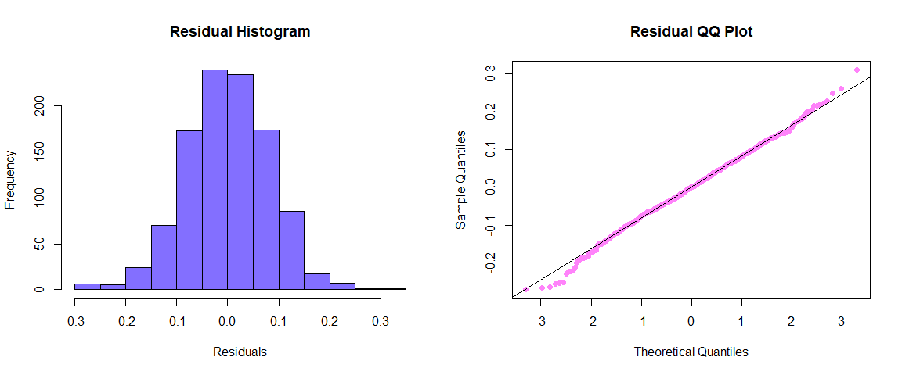<!-- -->

``` r
skewness(model$residuals)
```

    ## [1] -0.05945234

``` r
kurtosis(model$residuals,excess = FALSE)
```

    ## [1] 3.343308

``` r
par(mfrow=c(1,1))
```

(5)(b) Plot the residuals versus L\_VOLUME, coloring the data points by
CLASS and, a second time, coloring the data points by TYPE. Keep in mind
the y-axis and x-axis may be disproportionate which will amplify the
variability in the residuals. Present boxplots of the residuals
differentiated by CLASS and TYPE (These four plots can be conveniently
presented on one page using *par(mfrow..)* or *grid.arrange()*. Test the
homogeneity of variance of the residuals across classes using
*bartlett.test()* (Kabacoff Section 9.3.2, p. 222).

``` r
par(mfrow = c(2,2))

plot(L_VOLUME, model$residuals, main="Residuals vs. L_Volume (Class)", col=mydata$CLASS, xlab="L_VOLUME", ylab="Residuals")
legend("bottomright",levels(mydata$CLASS),col=1:length(mydata$CLASS), pch=1, title="CLASS")

plot(L_VOLUME, model$residuals, main="Residuals vs L_Volume (Type)", col=c("green","blue")[mydata$TYPE], xlab="L_VOLUME", ylab="Residuals")
legend("bottomright",levels(mydata$TYPE),col=c("green","blue"), pch=1, title="TYPE")

boxplot(model$residuals ~ mydata$CLASS,col=2:6, main="Residuals by Class",xlab="Class",ylab="Residuals")
boxplot(model$residuals ~ mydata$TYPE,col=c("green","blue"), main="Residuals by Type",xlab="Type",ylab="Residuals")
```

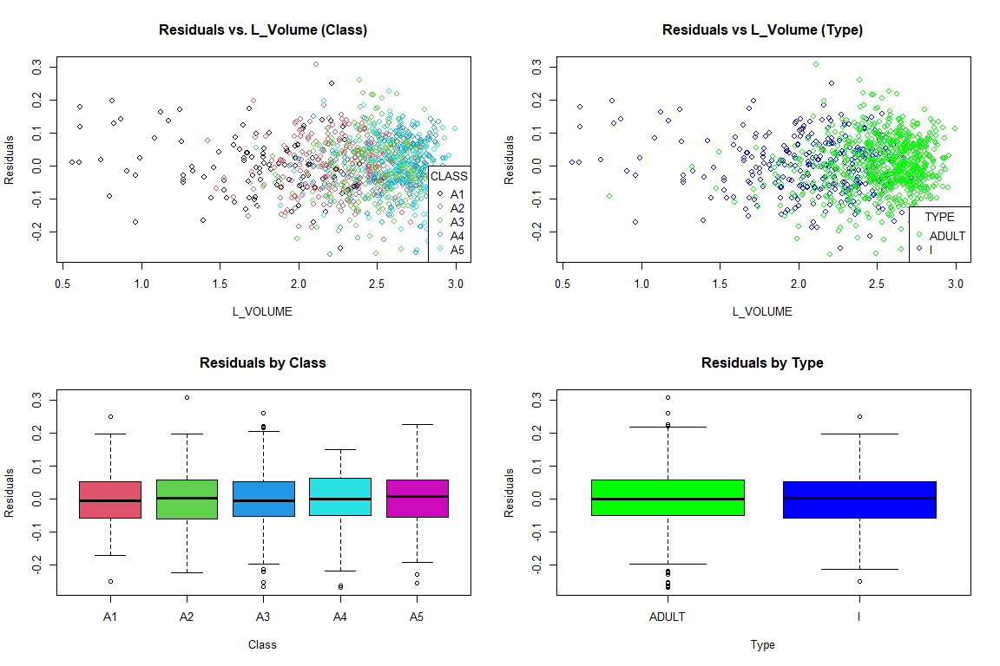<!-- -->

``` r
par(mfrow = c(1,1))

bartlett.test(model$residuals ~ mydata$CLASS)
```

    ## 
    ##  Bartlett test of homogeneity of variances
    ## 
    ## data:  model$residuals by mydata$CLASS
    ## Bartlett's K-squared = 3.6882, df = 4, p-value = 0.4498

**Essay Question: What is revealed by the displays and calculations in
(5)(a) and (5)(b)? Does the model ‘fit’? Does this analysis indicate
that L\_VOLUME, and ultimately VOLUME, might be useful for harvesting
decisions? Discuss.**

***Answer: The residuals are normally distributed according to the
histogram and most of them are on the QQ line with only a few
exceptions, indicating a very low skew (\~ -0.05).When looking at the
scatter plot, we see the residuals clustered around volumes between 2-3,
suggesting that they might not be useful for harvesting decisions. From
the histograms, we can see that nearly all classes and both types have
residuals with a mean of 0 and not that many outliers. ***

-----

Harvest Strategy:

There is a tradeoff faced in managing abalone harvest. The infant
population must be protected since it represents future harvests. On the
other hand, the harvest should be designed to be efficient with a yield
to justify the effort. This assignment will use VOLUME to form binary
decision rules to guide harvesting. If VOLUME is below a “cutoff”
(i.e. a specified volume), that individual will not be harvested. If
above, it will be harvested. Different rules are possible.The Management
needs to make a decision to implement 1 rule that meets the business
goal.

The next steps in the assignment will require consideration of the
proportions of infants and adults harvested at different cutoffs. For
this, similar “for-loops” will be used to compute the harvest
proportions. These loops must use the same values for the constants
min.v and delta and use the same statement “for(k in 1:10000).”
Otherwise, the resulting infant and adult proportions cannot be directly
compared and plotted as requested. Note the example code supplied below.

-----

***\#\#\#\# Section 6: (5 points) \#\#\#\#***

(6)(a) A series of volumes covering the range from minimum to maximum
abalone volume will be used in a “for loop” to determine how the harvest
proportions change as the “cutoff” changes. Code for doing this is
provided.

``` r
idxi <- mydata$TYPE == "I"
idxa <- mydata$TYPE == "ADULT"

max.v <- max(mydata$VOLUME)
min.v <- min(mydata$VOLUME)
delta <- (max.v - min.v)/10000
prop.infants <- numeric(10000)
prop.adults <- numeric(10000)
volume.value <- numeric(10000)

total.infants <- sum(idxi)  
total.adults <- sum(idxa)

for (k in 1:10000) { 
    value <- min.v + k*delta
    volume.value[k] <- value
    prop.infants[k] <- sum(mydata$VOLUME[idxi] <= value)/total.infants
    prop.adults[k] <-  sum(mydata$VOLUME[idxa] <= value)/total.adults
}
```

(6)(b) Our first “rule” will be protection of all infants. We want to
find a volume cutoff that protects all infants, but gives us the largest
possible harvest of adults. We can achieve this by using the volume of
the largest infant as our cutoff. You are given code below to identify
the largest infant VOLUME and to return the proportion of adults
harvested by using this cutoff. You will need to modify this latter code
to return the proportion of infants harvested using this cutoff.
Remember that we will harvest any individual with VOLUME greater than
our cutoff.

``` r
# Largest infant volume
(max_inf_vol <- max(mydata$VOLUME[mydata$TYPE == "I"]))  # [1] 526.6383
```

    ## [1] 526.6383

``` r
# Proportion of adults harvested
sum(mydata$VOLUME[mydata$TYPE == "ADULT"] > max_inf_vol) /
  total.adults  # [1] 0.2476573
```

    ## [1] 0.2476573

``` r
# Add code to calculate the proportion of infants harvested
sum(mydata$VOLUME[mydata$TYPE == "I"] > max_inf_vol)/total.infants
```

    ## [1] 0

``` r
# If we use the largest infant volume, we harvest approximately 24.8% of adults and 0%,
# as expected, of infants.
```

(6)(c) Our next approaches will look at what happens when we use the
median infant and adult harvest VOLUMEs. Using the median VOLUMEs as our
cutoffs will give us (roughly) 50% harvests. We need to identify the
median volumes and calculate the resulting infant and adult harvest
proportions for both.

``` r
# Add code to determine the median infant volume:
med_inf = median(mydata$VOLUME[mydata$TYPE=="I"])
med_inf
```

    ## [1] 133.8214

``` r
# Add code to calculate the proportion of infants harvested
sum(mydata$VOLUME[mydata$TYPE == "I"] > med_inf)/total.infants
```

    ## [1] 0.4982699

``` r
# Add code to calculate the proportion of adults harvested
sum(mydata$VOLUME[mydata$TYPE == "ADULT"] > med_inf)/total.adults
```

    ## [1] 0.9330656

``` r
# If we use the median infant volume as our cutoff, we harvest almost 50% of our infants
# and a little more than 93% of our adults.


# Add code to determine the median adult volume:
med_adlt = median(mydata$VOLUME[mydata$TYPE=="ADULT"])
med_adlt
```

    ## [1] 384.5584

``` r
# Add code to calculate the proportion of infants harvested
sum(mydata$VOLUME[mydata$TYPE == "I"] > med_adlt)/total.infants
```

    ## [1] 0.02422145

``` r
# Add code to calculate the proportion of adults harvested
sum(mydata$VOLUME[mydata$TYPE == "ADULT"] > med_adlt)/total.adults
```

    ## [1] 0.4993307

``` r
# If we use the median adult volume as our cutoff, we harvest almost 50% of adults
# and approximately 2.4% of infants.
```

(6)(d) Next, we will create a plot showing the infant conserved
proportions (i.e. “not harvested,” the prop.infants vector) and the
adult conserved proportions (i.e. prop.adults) as functions of
volume.value. We will add vertical A-B lines and text annotations for
the three (3) “rules” considered, thus far: “protect all infants,”
“median infant” and “median adult.” Your plot will have two (2) curves
- one (1) representing infant and one (1) representing adult proportions
as functions of volume.value - and three (3) A-B lines representing the
cutoffs determined in (6)(b) and (6)(c).

``` r
plot(volume.value,prop.adults, main="Proportion of Adults and Infants Protected",xlab="Volume", ylab="Proportion", col="blue", cex=0.5)
par(new=T)
plot(volume.value,prop.infants, xlab="Volume", ylab="Proportion", axes=F, col="red", cex=0.5)


legend("bottomright", legend=c("Adult","Infant"), pch = 19, col=c("blue","red"))

abline(h=.5, lty=2)

abline(v=med_adlt)
text(med_adlt+30, 0.45, labels=round(med_adlt,1))

abline(v=med_inf)
text(med_inf+30, 0.45, labels=round(med_inf,1))

abline(v=max_inf_vol)
text(max_inf_vol+30, 0.95, labels=round(max_inf_vol,1) )
```

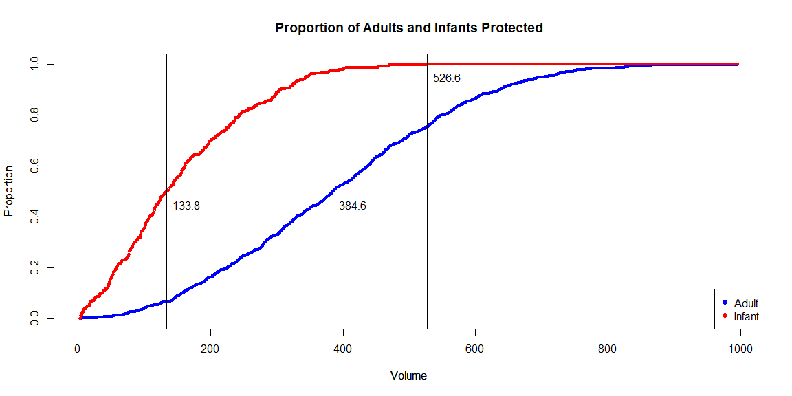<!-- -->

**Essay Question: The two 50% “median” values serve a descriptive
purpose illustrating the difference between the populations. What do
these values suggest regarding possible cutoffs for harvesting?**

***Answer: The difference in median values is large enough where the
harvest of adults will give a sufficient yield. The infant harvest is
low enough that there are enough protected infants to provide for future
harvests. This suggests that the current level is good for harvesting.
***

-----

More harvest strategies:

This part will address the determination of a cutoff volume.value
corresponding to the observed maximum difference in harvest percentages
of adults and infants. In other words, we want to find the volume value
such that the vertical distance between the infant curve and the adult
curve is maximum. To calculate this result, the vectors of proportions
from item (6) must be used. These proportions must be converted from
“not harvested” to “harvested” proportions by using (1 - prop.infants)
for infants, and (1 - prop.adults) for adults. The reason the proportion
for infants drops sooner than adults is that infants are maturing and
becoming adults with larger volumes.

-----

***\#\#\#\# Section 7: (10 points) \#\#\#\#***

(7)(a) Evaluate a plot of the difference ((1 - prop.adults) - (1 -
prop.infants)) versus volume.value. Compare to the 50% “split” points
determined in (6)(a). There is considerable variability present in the
peak area of this plot. The observed “peak” difference may not be the
best representation of the data. One solution is to smooth the data to
determine a more representative estimate of the maximum difference.

``` r
difference <- (1 - prop.adults) - (1 - prop.infants)
plot(volume.value,difference,main="Difference in Harvested Proportions", col="royalblue",xlab="Volume",ylab="Difference", type="l")
```

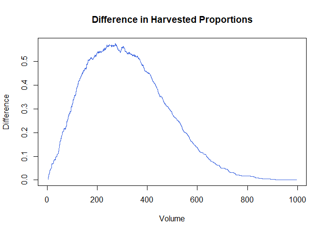<!-- -->

(7)(b) Since curve smoothing is not studied in this course, code is
supplied below. Execute the following code to create a smoothed curve to
append to the plot in (a). The procedure is to individually smooth
(1-prop.adults) and (1-prop.infants) before determining an estimate of
the maximum difference.

``` r
y.loess.a <- loess(1 - prop.adults ~ volume.value, span = 0.25,
    family = c("symmetric"))
y.loess.i <- loess(1 - prop.infants ~ volume.value, span = 0.25,
    family = c("symmetric"))
smooth.difference <- predict(y.loess.a) - predict(y.loess.i)
```

(7)(c) Present a plot of the difference ((1 - prop.adults) - (1 -
prop.infants)) versus volume.value with the variable smooth.difference
superimposed. Determine the volume.value corresponding to the maximum
smoothed difference (Hint: use *which.max()*). Show the estimated peak
location corresponding to the cutoff determined.

Include, side-by-side, the plot from (6)(d) but with a fourth vertical
A-B line added. That line should intercept the x-axis at the “max
difference” volume determined from the smoothed curve here.

``` r
par(mfrow=c(1,2))

plot(volume.value,difference,main="Difference in Harvested Proportions", col="royalblue",xlab="Volume",ylab="Difference", type="l")
par(new=T)
plot(volume.value,smooth.difference,type = "l", col="red",xlab="",ylab="",axes=FALSE)

abline(v=volume.value[which.max(smooth.difference)], col="green")
cutoff = volume.value[which.max(smooth.difference)]
text(volume.value[which.max(smooth.difference)], difference[which.max(smooth.difference)]-0.07, label=round(volume.value[which.max(smooth.difference)],2))

plot(volume.value,prop.adults, main="Proportion of Adults and Infants Protected",xlab="Volume", ylab="Proportion", col="blue", cex=0.5)
par(new=T)
plot(volume.value,prop.infants, xlab="Volume", ylab="Proportion", axes=F, col="red", cex=0.5)


legend("bottomright", legend=c("Adult","Infant"), pch = 19, col=c("blue","red"))

abline(h=.5, lty=2)

abline(v=med_adlt)
text(med_adlt+30, 0.45, labels=round(med_adlt,1))

abline(v=med_inf)
text(med_inf+30, 0.45, labels=round(med_inf,1))

abline(v=max_inf_vol)
text(max_inf_vol+30, 0.95, labels=round(max_inf_vol,1) )

abline(v=cutoff)
text(cutoff+30, 0.80, labels=round(cutoff,1))
```

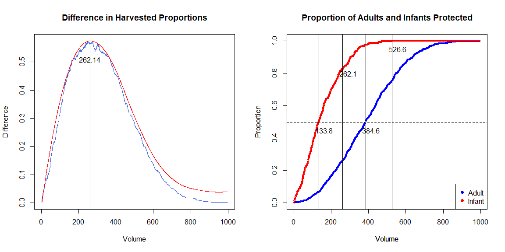<!-- -->

``` r
par(mfrow=c(1,1))
```

(7)(d) What separate harvest proportions for infants and adults would
result if this cutoff is used? Show the separate harvest proportions. We
will actually calculate these proportions in two ways: first, by
‘indexing’ and returning the appropriate element of the (1 -
prop.adults) and (1 - prop.infants) vectors, and second, by simply
counting the number of adults and infants with VOLUME greater than the
vlume threshold of interest.

Code for calculating the adult harvest proportion using both approaches
is provided.

``` r
(1 - prop.adults)[which.max(smooth.difference)]  # [1] 0.7416332
```

    ## [1] 0.7416332

``` r
# OR,
sum(mydata[mydata$TYPE == "ADULT", "VOLUME"] >
      volume.value[which.max(smooth.difference)]) / total.adults  # [1] 0.7416332
```

    ## [1] 0.7416332

``` r
# Add code to calculate the proportion of infants harvested
(1 - prop.infants)[which.max(smooth.difference)]
```

    ## [1] 0.1764706

``` r
# Add code to output the "maximum smoothed difference" volume cutoff:
volume.value[which.max(smooth.difference)]
```

    ## [1] 262.143

-----

There are alternative ways to determine cutoffs. Two such cutoffs are
described below.

-----

***\#\#\#\# Section 8: (10 points) \#\#\#\#***

(8)(a) Harvesting of infants in CLASS “A1” must be minimized. The
smallest volume.value cutoff that produces a zero harvest of infants
from CLASS “A1” may be used as a baseline for comparison with larger
cutoffs. Any smaller cutoff would result in harvesting infants from
CLASS “A1.”

Compute this cutoff, and the proportions of infants and adults with
VOLUME exceeding this cutoff. Code for determining this cutoff is
provided. Show these proportions. You may use either the ‘indexing’ or
‘count’ approach, or both.

``` r
 cutoff_2 = volume.value[volume.value > max(mydata[mydata$CLASS == "A1" &
  mydata$TYPE == "I", "VOLUME"])][1] # [1] 206.786


# Add code to calculate the proportion of infants harvested
(1-prop.infants)[which(volume.value==cutoff_2)]
```

    ## [1] 0.2871972

``` r
# Add code to calculate the proportion of adults harvested
(1-prop.adults)[which(volume.value==cutoff_2)]
```

    ## [1] 0.8259705

(8)(b) Next, append one (1) more vertical A-B line to our (6)(d) graph.
This time, showing the “zero A1 infants” cutoff from (8)(a).

``` r
plot(volume.value,prop.adults, main="Proportion of Adults and Infants Protected",xlab="Volume", ylab="Proportion", col="blue", cex=0.5)
par(new=T)
plot(volume.value,prop.infants, xlab="Volume", ylab="Proportion", axes=F, col="red", cex=0.5)


legend("bottomright", legend=c("Adult","Infant"), pch = 19, col=c("blue","red"))

abline(h=.5, lty=2)

abline(v=med_adlt)
text(med_adlt+30, 0.45, labels=round(med_adlt,1))

abline(v=med_inf)
text(med_inf+30, 0.45, labels=round(med_inf,1))

abline(v=max_inf_vol)
text(max_inf_vol+30, 0.95, labels=round(max_inf_vol,1) )

abline(v=cutoff)
text(cutoff+30, 0.80, labels=round(cutoff,1))

abline(v=cutoff_2)
text(cutoff_2+30,0.6,labels=round(cutoff_2,1))
```

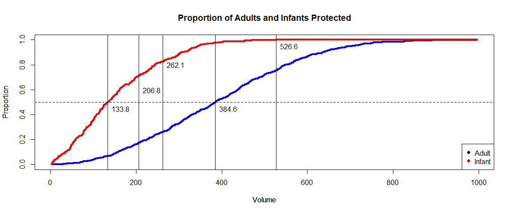<!-- -->

***\#\#\#\# Section 9: (5 points) \#\#\#\#***

(9)(a) Construct an ROC curve by plotting (1 - prop.adults) versus (1 -
prop.infants). Each point which appears corresponds to a particular
volume.value. Show the location of the cutoffs determined in (7) and (8)
on this plot and label each.

``` r
plot((1-prop.infants),(1-prop.adults), xlab="Infant Harvest Prop",ylab="Adult Harvest Prop", main="ROC Curve",col="mediumspringgreen", type = "l", lwd=2)

points((1-prop.infants)[which(volume.value==cutoff)],(1-prop.adults)[which(volume.value==cutoff)], pch=5)
text(0.30, 0.75, labels="max difference vol=262.1", cex=0.75)

points((1-prop.infants)[which(volume.value==cutoff_2)],(1-prop.adults)[which(volume.value==cutoff_2)], pch=5)
text(0.43, 0.83, labels="Zero A1 infants vol=206.8", cex=0.75)
```

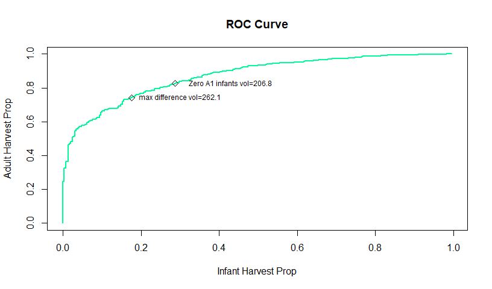<!-- -->

(9)(b) Numerically integrate the area under the ROC curve and report
your result. This is most easily done with the *auc()* function from the
“flux” package. Areas-under-curve, or AUCs, greater than 0.8 are taken
to indicate good discrimination potential.

``` r
auc((1-prop.infants),(1-prop.adults))
```

    ## [1] 0.8666894

***\#\#\#\# Section 10: (10 points) \#\#\#\#***

(10)(a) Prepare a table showing each cutoff along with the following: 1)
true positive rate (1-prop.adults, 2) false positive rate
(1-prop.infants), 3) harvest proportion of the total population

To calculate the total harvest proportions, you can use the ‘count’
approach, but ignoring TYPE; simply count the number of individuals
(i.e. rows) with VOLUME greater than a given threshold and divide by the
total number of individuals in our dataset.

``` r
TPR_R1 = round(sum(mydata$VOLUME[mydata$TYPE == "ADULT"] > max_inf_vol)/total.adults,3)
TPR_R2 = round(sum(mydata$VOLUME[mydata$TYPE == "ADULT"] > med_inf)/total.adults,3)
TPR_R3 = round(sum(mydata$VOLUME[mydata$TYPE == "I"] > med_inf)/total.infants,3)
TPR_R4 = round((1 - prop.adults)[which.max(smooth.difference)],3)
TPR_R5 = round((1-prop.adults)[which(volume.value==cutoff_2)],3)

FPR_R1 = 0.000
FPR_R2 = sum(mydata$VOLUME[mydata$TYPE == "I"] > med_inf)/total.infants
FPR_R3 = sum(mydata$VOLUME[mydata$TYPE == "I"] > med_adlt)/total.infants
FPR_R4 = (1 - prop.infants)[which.max(smooth.difference)]
FPR_R5 = (1-prop.infants)[which(volume.value==cutoff_2)]

TH1 = sum(mydata$VOLUME>max_inf_vol)/1036
TH2 = sum(mydata$VOLUME>med_inf)/1036
TH3 = sum(mydata$VOLUME>med_adlt)/1036
TH4 = sum(mydata$VOLUME>cutoff)/1036
TH5 = sum(mydata$VOLUME>cutoff_2)/1036
table = matrix(c(max_inf_vol,TPR_R1,FPR_R1,TH1, med_inf,TPR_R2,FPR_R2,TH2,med_adlt,TPR_R3,FPR_R3,TH3,cutoff,TPR_R4,FPR_R4,TH4,cutoff_2,TPR_R5,FPR_R5,TH5),nrow=5,ncol=4,byrow=TRUE)
rownames(table) = c("Protect all Infants", "Median Infants", "Median Adults", "Max Difference", "Zero A1 Infants")
colnames(table) = c("Volume", "TPR", "FPR", "totalHarvest")
t = as.table(table)
t
```

    ##                           Volume          TPR          FPR totalHarvest
    ## Protect all Infants 526.63834130   0.24800000   0.00000000   0.17857143
    ## Median Infants      133.82145000   0.93300000   0.49826990   0.81177606
    ## Median Adults       384.55839450   0.49800000   0.02422145   0.36679537
    ## Max Difference      262.14300973   0.74200000   0.17647059   0.58397683
    ## Zero A1 Infants     206.78597957   0.82600000   0.28719723   0.67567568

**Essay Question: Based on the ROC curve, it is evident a wide range of
possible “cutoffs” exist. Compare and discuss the three cutoffs
determined in this assignment.**

***Answer: The median adult cutoff has the lowest FPR, but also the
lowest TPR. Zero A1 infants has a low volume cutoff but the FPR is very
high. The max difference is between these two values and offers a middle
ground option, which seems to be the best.***

**Final Essay Question: Assume you are expected to make a presentation
of your analysis to the investigators How would you do so? Consider the
following in your answer:**

1.  Would you make a specific recommendation or outline various choices
    and tradeoffs?
2.  What qualifications or limitations would you present regarding your
    analysis?
3.  If it is necessary to proceed based on the current analysis, what
    suggestions would you have for implementation of a cutoff?  
4.  What suggestions would you have for planning future abalone studies
    of this type?

***Answer: I would probably recommend the max difference choice if I had
to pick one, but make sure to note the tradeoff with the FPR. I would
definitely make sure to highlight the limitations of abalone
classification, and make sure to present any plots with skewing or
outliers. If it was necessary to proceed, I would stress the importance
of a cutoff that would not potentially be detrimental to future
harvests. For future studies, I would collect a larger sample, try to
remove variables with duplicate information, and possibly add more
variables that could classify and organize the abalones. ***
